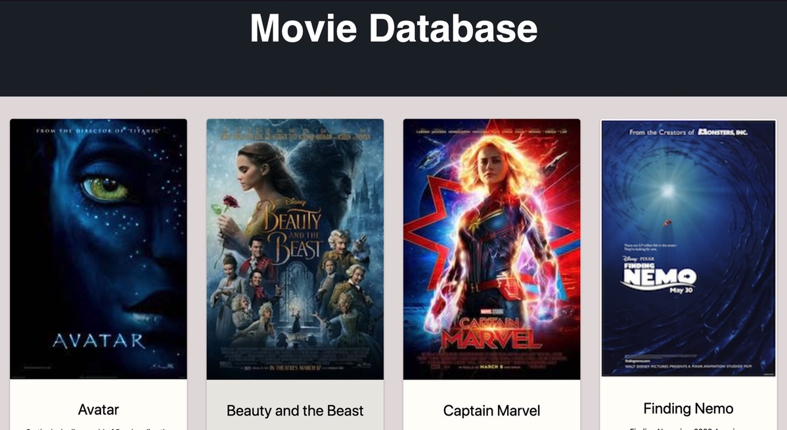
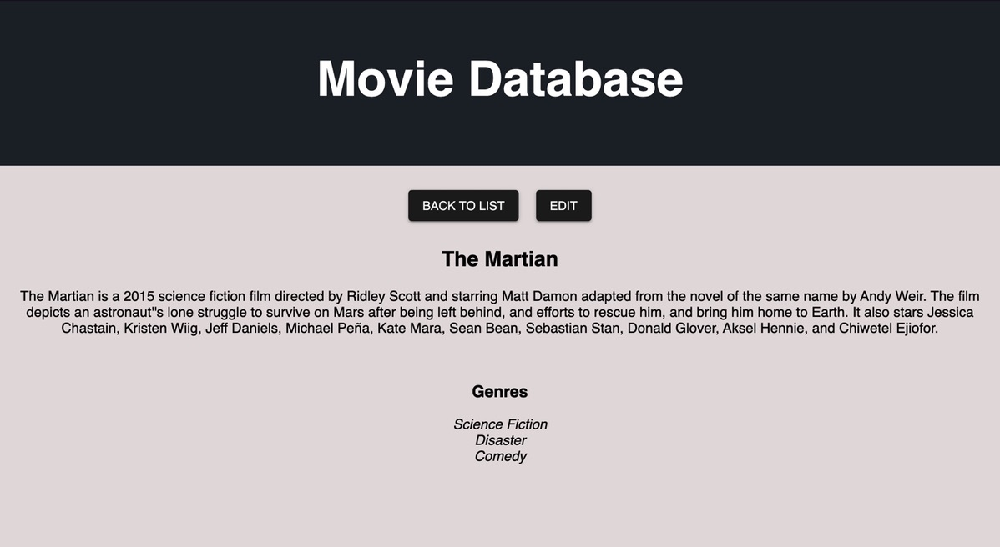
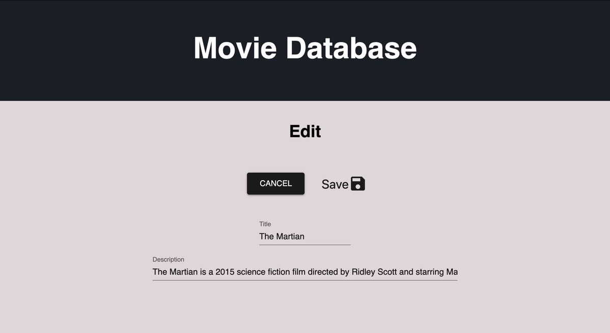

# Movie Sagas Master

## Description

Duration: 2 days

This application is a movie database. Users can view cards that display a poster, title, and description of the movie on the movie homepage. When a movie poster is clicked the user is sent to a details page that displays further details such as genres for the selected movie. On the details page there are two buttons; a back to list and edit button. The edit button will send users to the edit page where they can edit the title and description of the movie. On this page users can also cancel edits or save edits to the database. Edited information will update for the other pages as well.

## Database Setup

View database.sql file for database set-up.

## Install Dependencies

1. npm install
2. npm run server
3. npm run client

## Screen Shots

## Prerequisites

- React
- Redux
- Express
- Saga
- SQL
- material-ui

## License

This project is licensed under the MIT License

## Acknowledgement

Thanks to Prime Digital Academy who equipped and helped me to make this application a reality. Thank you Caleb and Hyunsu for working together with me on the weekend assignments.
